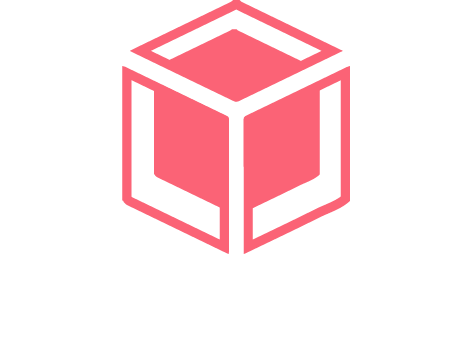

    
      
    <h2>Private and encrypted file management in the cloud

HiddenBox is a secure, distributed file storage application that uses sharding, encryption and redundancy techniques to ensure data integrity and availability. Implemented with modern technologies such as Python, Ansible, Terraform, Docker and React, HiddenBox offers a robust and scalable solution for file management in the cloud.

> [!WARNING]
> This application is under development.

    

        
    

    

        
    

    

        
    

## Main features

- **Advanced encryption**: Files are encrypted using symmetric cryptography algorithms before being fragmented and stored.

- **Fragmentation and redundancy**: Files are split into multiple fragments distributed across storage nodes, with redundancy for fault tolerance.

- **Infrastructure as code**: Infrastructure is deployed and managed using Terraform and Ansible, enabling reproducible and scalable configuration.

- **Intuitive web interface**: Frontend developed with Angular that allows users to easily upload, download and manage their files.

- **Automated deployment**: Use of Docker and Docker Compose for easy deployment and management of services.

Translated with DeepL.com (free version)

## Documentation

## Hiddenbox architecture

## Contributions

Want to contribute? There are multiple ways you can contribute to this project. Here are some ideas:

* [Translate the web into multiple languages!](/docs/CONTRIBUTING.md#translations)
* [Reporting Bugs](/docs/CONTRIBUTING.md#reporting-bugs) 
* [Check out some issues](https://github.com/sporestudio/hiddenbox/issues) (or translate them).

## License
This project is under [GNU General Public License](./LICENSE).
